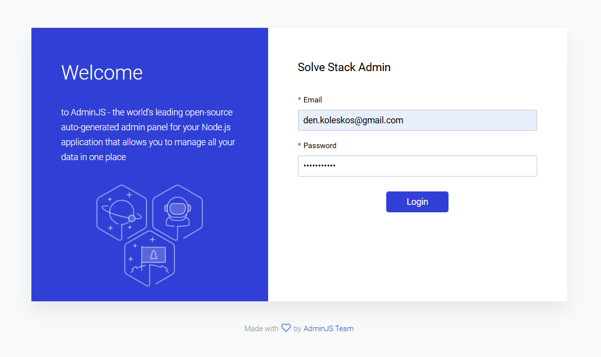
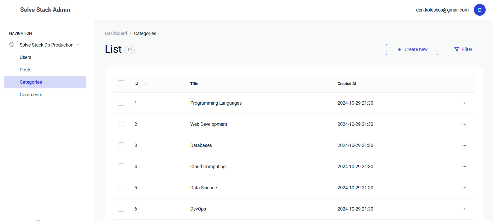
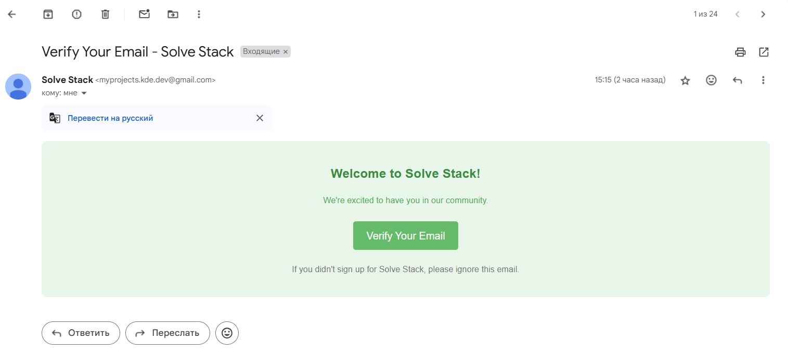
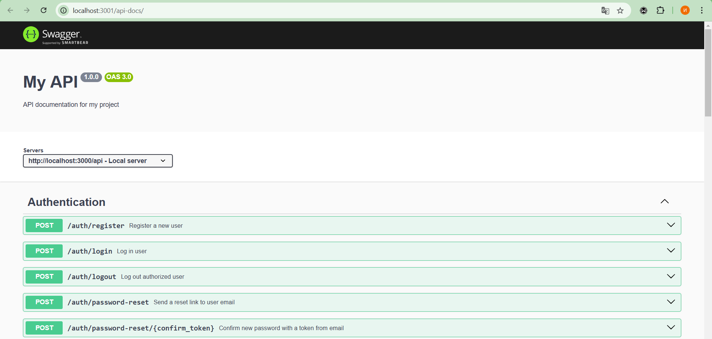

# USOF Backend

**USOF** is a backend API designed to facilitate a Q&A service for programmers and enthusiasts to share knowledge. It includes user and admin interfaces for managing posts, comments, likes, and profiles. This project is built with Node.js, follows the MVC pattern, and utilizes **AdminJS** for admin panel management, **Nodemailer** for email functionalities, and a relational database for data storage.

## Table of Contents
- [Overview](#overview)
- [Features](#features)
- [Requirements and Dependencies](#requirements-and-dependencies)
- [Setup Instructions](#setup-instructions)
- [Usage](#usage)
- [Authentication](#authentication)
- [Sample Credentials](#sample-credentials)
- [AdminJS Interface](#adminjs-interface)
- [Nodemailer Integration](#nodemailer-integration)
- [API Documentation](#api-documentation)

## Overview
The **USOF Backend** API provides robust capabilities for managing user-generated content, including user registration, post management, comments, and role-based access control. An admin interface, accessible at `/admin`, allows privileged users to manage platform content, while the API provides endpoints for user actions and interactions with the service.

## Features
- **User Roles**: Differentiated access for standard users and admins.
- **Admin Panel**: AdminJS interface at `/admin` for managing posts, users, categories and comments.
- **RESTful API**: Comprehensive endpoints for users, posts, comments, likes, and categories.
- **Email Integration**: Password reset functionality and verification email via **Nodemailer**.
- **Database Automation**: Automated setup of the database on first run or as needed.
- **Secure Storage**: User passwords are stored securely with best practices.

## Requirements and Dependencies
- **Node.js** (v14+ recommended)
- **NPM** (v10+ recommended)
- **MySQL** (v8+ recommended)

Before starting, ensure the required technologies are installed.

## Setup Instructions

To run this project locally, follow these steps:

1. **Clone the Repository**:
   ```bash
   git clone ...
   ```
2. **Install All Dependencies**:
   ```bash
   npm install
   ```
3. **Configure Database Credentials**:  
   - Open `config.root.json` and provide admin-level database credentials (user and password) that will be used to create the database.  
   - In `config.app.json`, specify the credentials (user and password) the application will use for ongoing interactions with the database. This user can be the same as in `config.root.json`, but may differ based on your access preferences.

4. **Initialize the Database**:
   - Run the following command to create the database and tables:
     ```bash
     npm run setupDatabase
     ```
   - Run this command only once to initialize the database. Rerunning it will reset the data.

5. **Launch the Application**:
    ```bash
    npm run launch
    ```
## Usage
- Admin Panel: Access the admin interface at `/admin` for managing users, posts, and comments.
- API Documentation: Full documentation of available endpoints is hosted at `/api-docs`.
- Using the API: You can test API endpoints directly in Postman or similar tools by providing appropriate authentication and data parameters.

## Authentication
Authentication uses JWT tokens, which are required for all endpoints except registration and login. Pass the JWT token in the Authorization header to access protected endpoints.

## Sample Credentials
Default test data includes users with the password: `qwerty123Aa@`.

## AdminJS Interface
AdminJS is used to create an admin panel at `/admin` that allows administrators to manage posts, users, comments, and other resources directly through a user-friendly interface. Only users with admin privileges have access to this panel.



## Nodemailer Integration
The API uses Nodemailer to send emails for features like password reset. To enable this feature, ensure the following variables in the provided .env file are set with valid credentials:
- `GMAIL_USER`: Email address for sending emails.
- `GMAIL_CLIENT_ID`: Client ID for Gmail API.
- `GMAIL_CLIENT_SECRET`: Client secret for Gmail API.
- `GMAIL_REFRESH_TOKEN`: Refresh token for Gmail API.
- `GMAIL_REDIRECT_URL`: Redirect URL for Gmail API.

Note: The `.env` file is already included in the project, so you only need to fill in the required values.



## API Documentation
The API documentation is accessible at `/api-docs`, providing detailed information on each available endpoint, request parameters, and expected responses.

